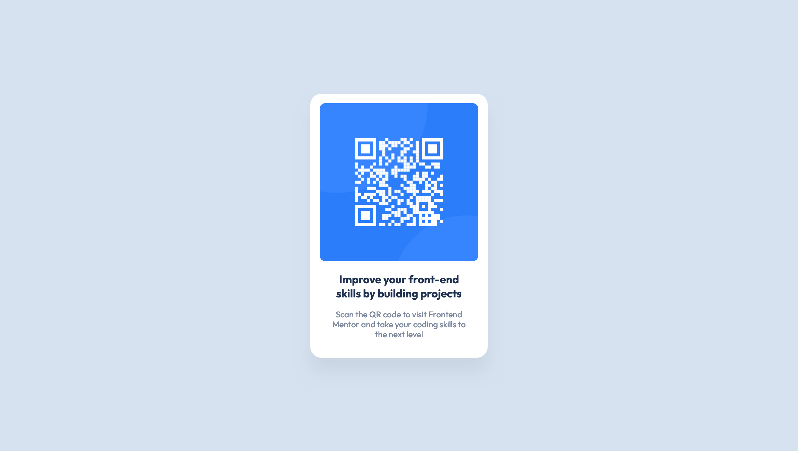

# Frontend Mentor - QR code component solution

This is a solution to the [QR code component challenge on Frontend Mentor](https://www.frontendmentor.io/challenges/qr-code-component-iux_sIO_H). Frontend Mentor challenges help you improve your coding skills by building realistic projects.

## Table of contents

- [Overview](#overview)
  - [Screenshot](#screenshot)
  - [Links](#links)
- [My process](#my-process)
  - [Built with](#built-with)
  - [What I learned](#what-i-learned)
  - [Continued development](#continued-development)
  - [Useful resources](#useful-resources)
- [Author](#author)

## Overview

This challenge involved building a QR code component and ensuring it looks as close to the design as possible.

### Screenshot



### Links

- Solution URL: [Add solution URL here](https://your-solution-url.com)
- Live Site URL: [Add live site URL here](https://your-live-site-url.com)

## My process

### Built with

- Semantic HTML5 markup
- CSS custom properties
- CSS Grid
- BEM Naming Convention

### What I learned

During this project, I learned how to implement the BEM naming convention. If there were more cards on the page, I could implement a modifier. For instance, if I wanted to add a modifier to a card to indicate a featured card, I could do something like:

```html
<main class="card card--featured">
</main>
```
```css
.card--featured {
  border: 2px solid var(--clr-darkblue);
}
```

### Continued development

I'll continue using BEM methodology for larger projects while exploring advanced CSS and JavaScript for more challenging, interactive future work.

### Useful resources

- [BEM Methodology](https://en.bem.info/methodology/) - The official BEM site provides documentation and examples.
- [BEM 101](https://css-tricks.com/bem-101/) - Robin Rendle's article on why we should consider using BEM with practical examples.

## Author

- Frontend Mentor - [@bolouie](https://www.frontendmentor.io/profile/bolouie)
- Twitter - [@bolouie](https://www.twitter.com/bo_louie)


